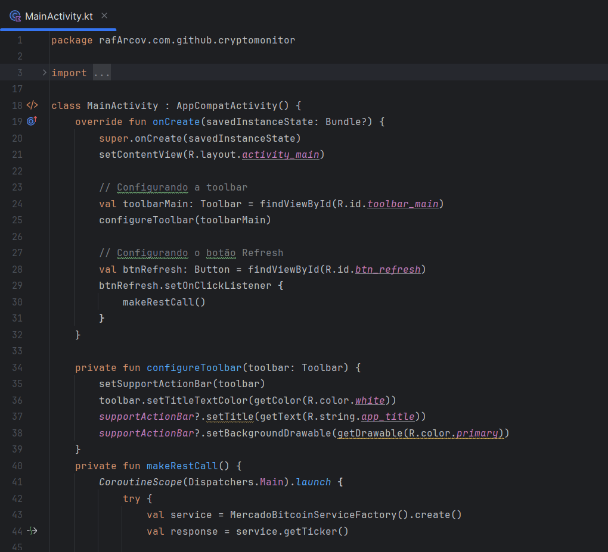
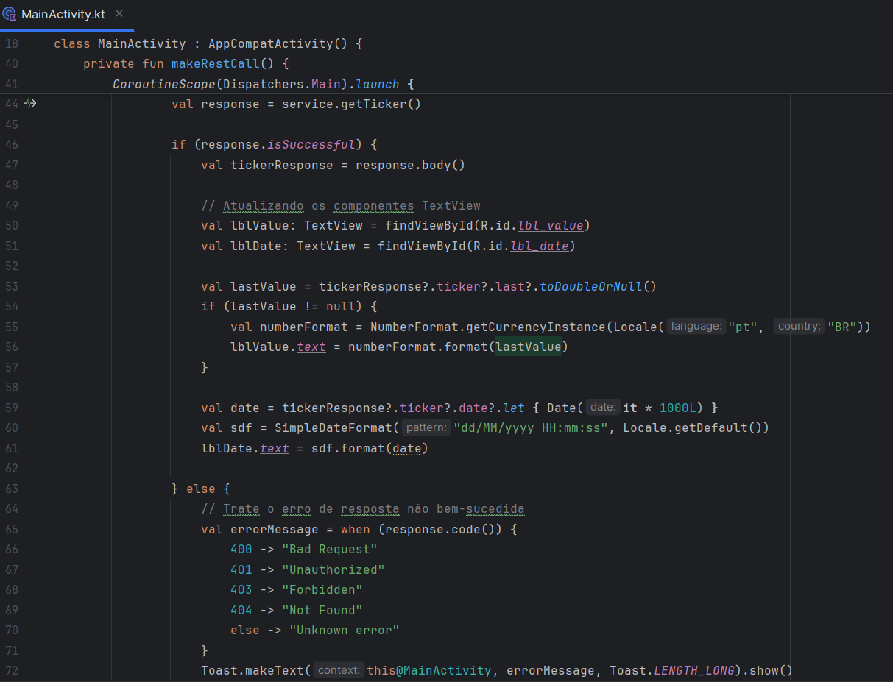
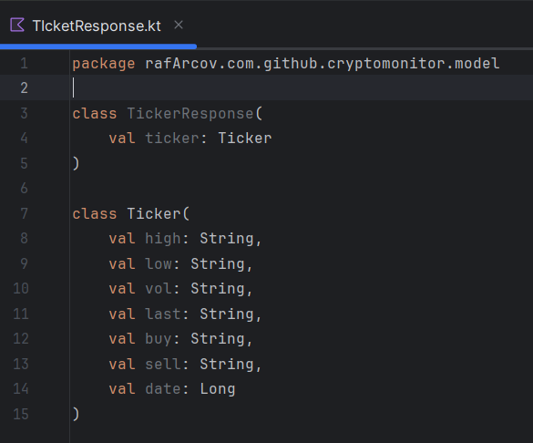
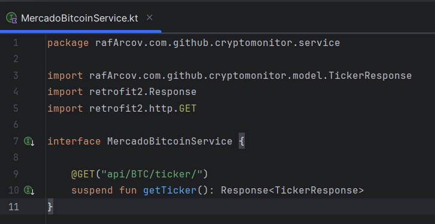
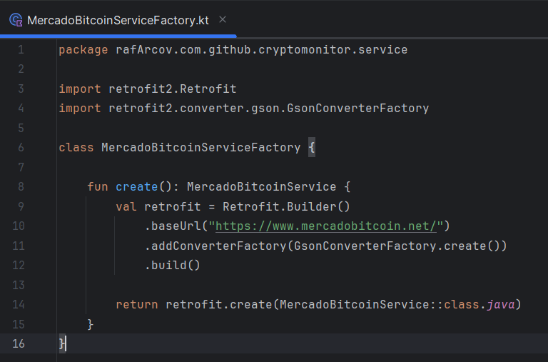
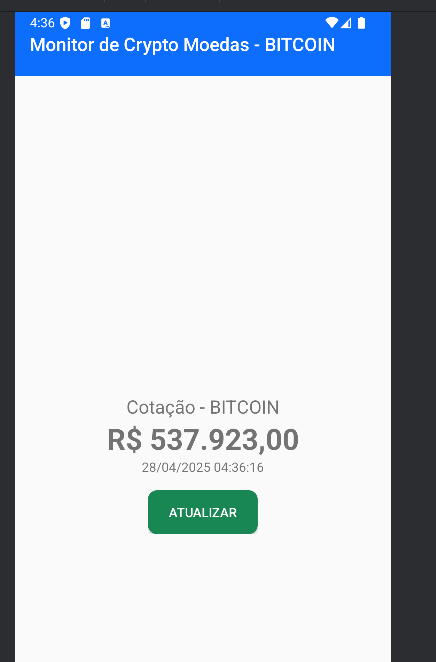
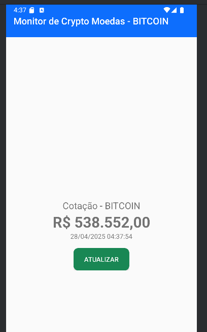

# Android Crypto Monitor

Este projeto é um aplicativo Android desenvolvido para monitorar o valor das criptomoedas em tempo real. Ele faz uso de APIs para obter dados atualizados sobre várias criptomoedas e exibi-los de maneira simples e intuitiva para o usuário. O projeto foi desenvolvido utilizando Kotlin, e tem como objetivo fornecer uma maneira fácil de acompanhar as variações de preço de criptomoedas diretamente do seu dispositivo Android.

## Estrutura do Projeto

O projeto é organizado da seguinte maneira:

- **MainActivity.kt**: Arquivo principal que contém a lógica do aplicativo, controlando a interface de usuário e interações.
- **TickerResponse.kt**: Define as estruturas de dados utilizadas para representar as criptomoedas e seus valores.
- **MercadoBitcoinService.kt**: Contém as funções responsáveis por fazer as requisições à API e processar as respostas.
- **MercadoBitcoinServiceFactory.kt**: Gerencia a criação de objetos relacionados à criptomoeda e outros componentes necessários ao funcionamento do aplicativo.

## Funcionamento

O aplicativo consulta dados de criptomoedas em tempo real através de uma API e exibe essas informações de forma clara para o usuário. Ele permite que o usuário veja o valor das principais criptomoedas e acompanhe as flutuações do mercado.

### Arquivos Kotlin

- **MainActivity.kt**: 
  Este arquivo contém a inicialização do aplicativo e a configuração da interface de usuário. Ele utiliza as classes e funções dos outros arquivos Kotlin para exibir as informações de maneira organizada na tela.

- **TickerResponse.kt**: 
  Aqui são definidos os modelos de dados que representam as criptomoedas. Esses modelos são usados para armazenar as informações como nome, símbolo e preço atual.

- **MercadoBitcoinService.kt**: 
  Este arquivo é responsável pela comunicação com a API externa. Ele gerencia as requisições HTTP e converte os dados recebidos em objetos Kotlin, que podem ser utilizados no restante do aplicativo.

- **MercadoBitcoinServiceFactory.kt**: 
  O factory é utilizado para simplificar a criação de objetos relacionados a criptomoedas. Isso torna o código mais organizado e facilita a manutenção do projeto.
  

## Testes e Evidências

O funcionamento do aplicativo pode ser testado ao iniciar o projeto em um dispositivo Android. A interface exibirá os preços das criptomoedas em tempo real, como mostrado nos prints abaixo.

### Prints de exemplo:

## Como Rodar

1. Clone este repositório: git clone https://github.com/rafArcov/android-crypto-monitor.git
2. Abra o projeto no Android Studio.
3. Execute o aplicativo em um dispositivo ou emulador Android.
